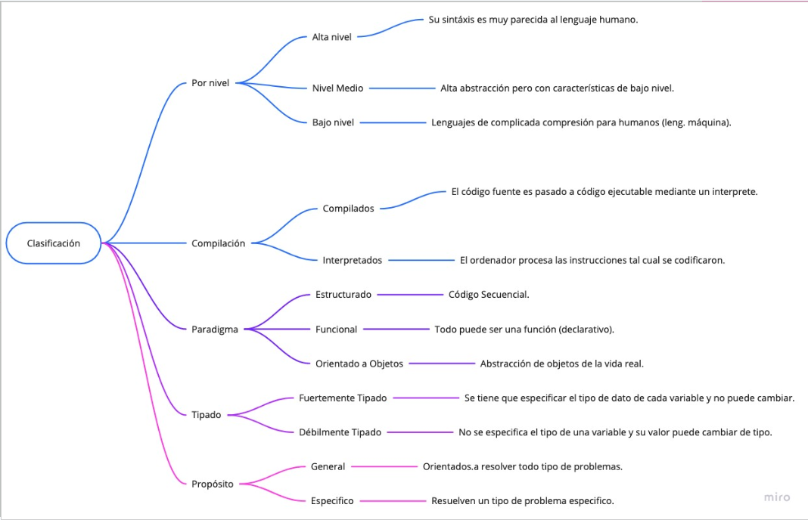
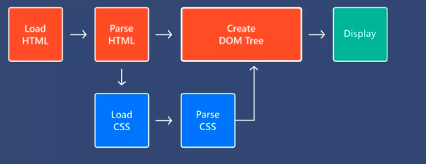

# JavaScript

Este documento es una **sintesis de la kata** (clases, campus, tareas y proyectos) **más temas extra** (estrechamente relacionados) para brindar la **posibilidad** al estudiante **de ampliar** sus **conocimientos**. Para su mejor aprovechamiento se recomienda **leerlo como guía** y **ampliar sus notas** con base en **investigación/autoestudio** y **ejercicios** subirlo a su propio repositorio.

**Estructura de carpetas sugerida**

- kata-1

  - g99-nombre-de-la-kata-1
  - g99-nombre-de-la-kata-1-juanito-banana
- kata-2

  - g99-nombre-de-la-kata-1
  - g99-nombre-de-la-kata-1-juanito-banana

## Temario

1. [Logica e introduccion a los lenguajes de programacion](#logica-e-introduccion-a-los-lenguajes-de-programacion)
2. [Fundamentos de JavaScript](#fundamentos-de-javascript)
3. [Frameworks CSS](#frameworks-css)
4. [Manipulacion del DOM](#manipulacion-del-dom)
5. [Presentaciones](#presentaciones)
6. [Informacion y recursos extra](#informacion-y-recursos-extra)
7. [Glosario](#glosario)

### Logica e introduccion a los lenguajes de programacion

#### **¿Qué es la programación?**

Es la creación de software para resolver problemas existentes o nuevos de la vida mediante código que contiene instrucciones claras (compuestas de entradas, procesos y salidas).

**Programar** es el proceso de diseñar, codificar y automatizar una tarea del mundo real mediante código.

#### **Lenguaje de programación**

Es un conjunto de reglas gramaticales (tanto sintácticas como semánticas) que instruyen a que un ordenador o dispositivo se comporte de una cierta manera. Cada lenguaje de programación tiene un vocabulario, un conjunto único de palabras clave que sigue a una sintaxis especial para formar y organizar instrucciones del ordenador.

#### Clasificación de los lenguajes de programación

Una clasificación mas podria ser el objetivo para el que se requiere, por ejemplo front end, back end, videojuegos, desarrollo de aplicaciones móviles, etc.

#### **¿Qué Lógica?**

Es el desarrollo de ideas de forma coherente y sin contradicciones. Si los sistemas se basan en necesidades del mundo real y en el mundo real se resuelven con lógica, suena razonable que sea un con lógica con lo que de deben programar los sistemas. Entre algunas de las cosas en que nos servirá son:

* Analizar problemas o necesidades de los usuarios.
* Comprender el alcance de un negocio y los elementos necesarios para dar atención.
* Generar la programación de los requerimientos funcionales y no funcionales.
* Crear soluciones de código y corregir bugs.
* Tener visión del producto.

#### Algoritmos

Un algoritmo es un conjunto de acciones que especifican la secuencia de operaciones realizadas, en orden, para resolver un problema.

**Partes de un algoritmo**

* **Entrada:** Se trata del conjunto de datos que el algoritmo necesita como insumo para procesar.
* **Proceso:** Son los pasos necesarios aplicados por el algoritmo a la entrada recibida para poder llegar a una salida o resolución del problema.
* **Salida:** Es el resultado producido por el algoritmo a partir del procesamiento de la entrada una vez terminada la ejecución del proceso.

**Representaciones de un algoritmo**

* **Lenguaje natural:** Es la forma tradicional de comunicación utilizada por los seres humanos.
* **Diagrama de flujo:** Es una representacion gráfica del algoritmo de un problema.
* **Pseudocodigo:** Es una forma de expresar los distintos pasos que va a realizar un programa de la forma más parecida a un lenguaje de programación (utlizando palabras clave). El pseudocodigo no puede ejecutarse directamente un ordenador ya que solo es una representacion para facilitar la solucion.
* **Código:** Es la solución de un problema en algun lenguaje de programación.

#### Variables

Las variables se usan para almacenar datos un espacio especifico. Generalmente es porque las necesitaremos utilizar en varias partes del código.

#### Tipos de variables

* **Simples o primitivas:** Guardan un solo valor.
  * Char.
  * String.
  * Number (int, float, double).
  * Boolean.
* **Complejas o de objeto:** Pueden guardar más de un solo dato.
  * **Objetos:** Son como un *diccionario* donde lo de claras con corchetes normales `{}` y se accede a sus propiedades median `objName.propName` o bien `objName['propName']`.
  * **Arreglos:** Son *listas* o *colecciones* de elementos donde lo declaras con corchetes cuadrados `[]` y accedes a ellos desde su indice.

#### Valores por defecto de una variable

Los valores por defecto representan el valor con el que se debe inicializar cada tipo de variable cuando no se conoce su valor especifico. Es una buena practica inicializar todas nuestras variables por defecto.

El **valor por defecto** de cada tipo de dato es:

* String y char "".
* Number int 0.
* Number float y double 0.0.
* Boolean false.
* Objeto {} o null.
* Array [] o null.

#### Parseo

Es el proceso de convertir el tipo de dato de una variable en otro tipo.

En JS existen los siguiente metodos como principales formas de parseo:

* parseInt: String a entero.
* parseFloat: String a decimal.
* toString(): Number (int/double/float) a String.
* Doble negación !!: Cualquier valor a Boolean.

#### Sentencias de control

Nos ayudan a controlar caminos o decisiones en nuestro sistema, se basa en la evluación de una o mas condiciones.

* **if, else if, else.**
* **switch.**

#### Ciclos

Nos ayudan a repetir cierta lógica de programación N veces.

* **for.**
* **while.**
* **do while.**

Todos los ciclos tienen un inicio, condición, razón de cambio y puede ir en orden descendente o ascendente.

#### Scope

Es el ámbito o lugar donde podemos utilizar una variable. Es cómo su ciclo de vida.

#### Funciones

Consiste en agrupar una lógica de programación (varias sentencias de código) que hagan una cosa en especifico dentro de un método.

**Consideraciones**

* Método y función son tipicamente conocidos como sinónimos.
* Parametros y argumentos son tipicamente conocidos como sinónimos.
* Las funciones pueden o no retornar valores.

### Fundamentos de JavaScript

#### ¿Qué es JavaScript?

JavaScript es un lenguaje de programación que los desarrolladores utilizan para hacer páginas web interactivas.

Es un lenguaje interpretado, se basa en el estándar ECMAScript, es orientado a objetos, basado en prototipos, imperativo, débilmente tipado y dinámico.

#### Fucionamiento

Funciona mediante el navegador de dos formas:

* Dentro del HTML con la etiqueta script.
* Con un archivo JS importado mediante el atributo src de la etiqueta script.

#### Keywords de JS

Las keywords o palabras reservadas son aquellas que no pueden utilizarse para el nombrado de variables o funciones propias debido a que cumplen una función especifica dentro del lenguaje JavaScript. Se recomienda consultar el [listado completo](https://www.w3schools.com/js/js_reserved.asp).

**Código JS**

La explicación de los temas listados a continuación se encuenta en código en la [carpeta de JS](./3-javascript/3.2-extern-js/js).

* console.log y comentarios.
* prompt, alert y document.write.
* Declaración e inicialización de variables, tipos de datos y valores por defecto.
* Operadores
  * De asignación.
  * Aritmeticos.
  * De comparación.
  * Lógicos.
* typeof
* null, undefined, NaN.
* parseo.
  * parseInt.
  * parseFloat.
  * toString().
  * Doble negación !!.
* sentencias de control.
  * if, if else y else.
  * switch.
* Ciclos.
  * while.
  * do while.
  * for.
* Operador ternario.
* Valores thruty y falsy.
* break y continue.
* Funciones.
* Ambito de vida de una variable (scope), let y const.
* Hoisting.

### Frameworks CSS

Existen herramientas que nos facilitan el desarrollo. Estas herramientas son **código gratuito** o **libre** **reutilizable** hecho por empresas o comunidades de desarrollo de software para el uso comun de los devs.

Existen de dos tipos principales:

* ****Librerias:** **Permiten solucionar un problema concreto.
* **Frameworks:** Brinda un set de herramientas para desarrollar sistemas o aplicaciones. Un framework, por lo general, contiene varias librerías y brinda soluciones a varias, provee buenas prácticas y resulta toda una experiencia de desarrollo.

Cómo hasta este punto ya se sabe más del desarrollo HTML/CSS y de JS apenas se esta aprendiendo comenzaremos hablando de los frameworks orientados a simplificarnos el desarrollo del maquetado.

#### Listado de frameworks CSS

* Boostrap.
* Foundation.
* Tailwind.
* Bulma.
* MaterializeCSS.
* Semantic UI.
* Pure.

### Manipulacion del DOM

#### Modelo de carga del DOM

**El DOM** de un **HTML** es un **modelo de objetos** que

JavaScript en conjunto con la Web APi nos brinda un set de funciones para poder hacer interactivos nuestros sitios. Con estas funciones podemos hacer cosas como:

1. Leer los elementos HTML existentes.
2. Obtener valores, atributos y contenido de los elementos.
3. Crear nuevos elementos.
4. Eliminar elementos.
5. Agregar contenido, atributos, clases a los elementos.
6. Agregar estilos dinámicamente.
7. Actualizar vistas, escuchar eventos y manejar la lógica.

#### Acceso a elemento HTML

Se puede realizar de dos formas:

* **document.getElementBy:** Funciona con un string con el nombre de el elemento al que queremos acceder.
  * **document.getElementById:** Obteniene un elemento HTML con dicho id.
  * **document.getElementByClassName:** Obtiene una colección de etiquetas HTML que coincidan con el nombre de clase indicado.
  * **document.getElementByTagName:** Obtiene una colección de etiquetas HTML que coinciden con el nombre de la etiqueta.
* **document.querySelector:** Funciona como selectores tipo CSS.
  * **document.querySelector:** Obteniene un elemento HTML con dicho id.
  * **document.querySelectorAll:** Obtiene un Node List de todos elementos que coniciden con la clase o etiqueta indicada.

Revisar ejemplo en código [aquí](./5-manipulacion-dom/5.1-acceso-elementos).

#### Modificación del DOM

#### Eventos

#### Event interface

#### Listado de eventos

A continuación se lista los eventos más comunes en el uso cotidiano del desarrollo web.

| **Tipo**     | **Evento HTML** | **Evento JS** | **Descripción** |
| ------------------ | --------------------- | ------------------- | ---------------------- |
| **Body**     | onload                | load                |                        |
|                    | onunload              | unload              |                        |
| **Forms**    | onchange              | change              |                        |
|                    | onblur                | blur                |                        |
|                    | onfocus               | focus               |                        |
|                    | onreset               | reset               |                        |
|                    | onselect              | select              |                        |
|                    | onsubmit              | submit              |                        |
|                    | oninvalid             | invalid             |                        |
|                    | oninput               | input               |                        |
| **Keyboard** | onkeydown             | keydown             |                        |
|                    | onkeypress            | keypress            |                        |
|                    | onkeyup               | keyup               |                        |
| **Mouse**    | onclick               | click               |                        |
|                    | ondbclick             | dbclick             |                        |
|                    | onmouseover           | mouseover           |                        |
|                    | onmousedown           | mousedown           |                        |
|                    | onmousemove           | mousemove           |                        |
|                    | onmouseout            | mouseout            |                        |
|                    | onmouseup             | mouseup             |                        |
|                    | onscroll              | scroll              |                        |
|                    | onresize              | resize              |                        |
| **Media**    | onabort               | abort               |                        |
| **Others**   | oncopy                | copy                |                        |
|                    | oncut                 | cut                 |                        |
|                    | onpaste               | paste               |                        |
|                    | ondrop                | drop                |                        |
|                    | ononline              | online              |                        |
|                    | onoffline             | offline             |                        |
|                    | onshow                | show                |                        |
|                    | onstorage             | storage             |                        |
|                    | onwheel               | wheel               |                        |

### Presentaciones

Se encuentran en la [carpeta assets](./assets/) de este mismo repo.

### Informacion y recursos extra

1. [EloquentJS](https://eloquentjavascript.net/).
2. [Clean code repo](https://github.com/ryanmcdermott/clean-code-javascript).
3. [Código limpio (libro)](https://ns2.elhacker.net/descargas/manuales/Lenguajes%20de%20Programacion/Codigo%20limpio%20-%20Robert%20Cecil%20Martin.pdf).
4. [Codewars]().
5. [Ejericicios para JS](./6-tareas/6.8-more-exercises.js).

### Glosario

Ir al [repo del glosario](https://github.com/montoyaguzman/tech-glossary).
